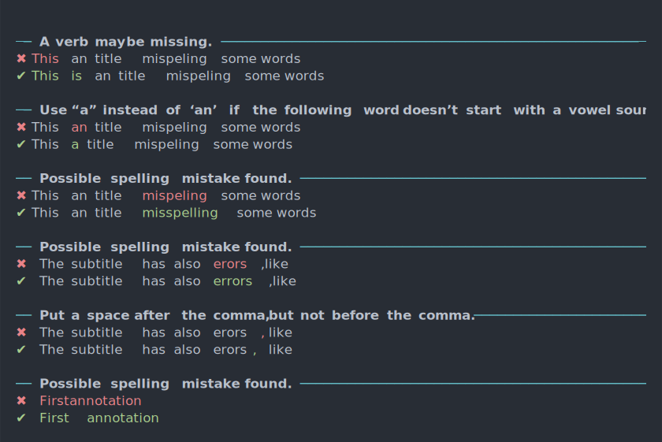

ggspell
================

Spell check text and ggplot objects with the LanguageTool API.

Install like this:

``` r
remotes::install_github("nicucalcea/ggspell")
```

Use like this for text.

``` r
# Check text
ggspell::ggspell("This is a error.")
```


Or check an entire plot.

``` r
# Check plot
starwars_plot <- dplyr::starwars |>
  head(10) |>
  ggplot2::ggplot(ggplot2::aes(x = height, y = name)) +
  ggplot2::geom_col() +
  ggplot2::geom_text(x = 168.7, y = 10, label = "Firstannotation") +
  ggplot2::labs(title = "This an title mispeling some words",
       subtitle = "The subtitle has also erors ,like")

ggspell::ggspell(starwars_plot)
```


